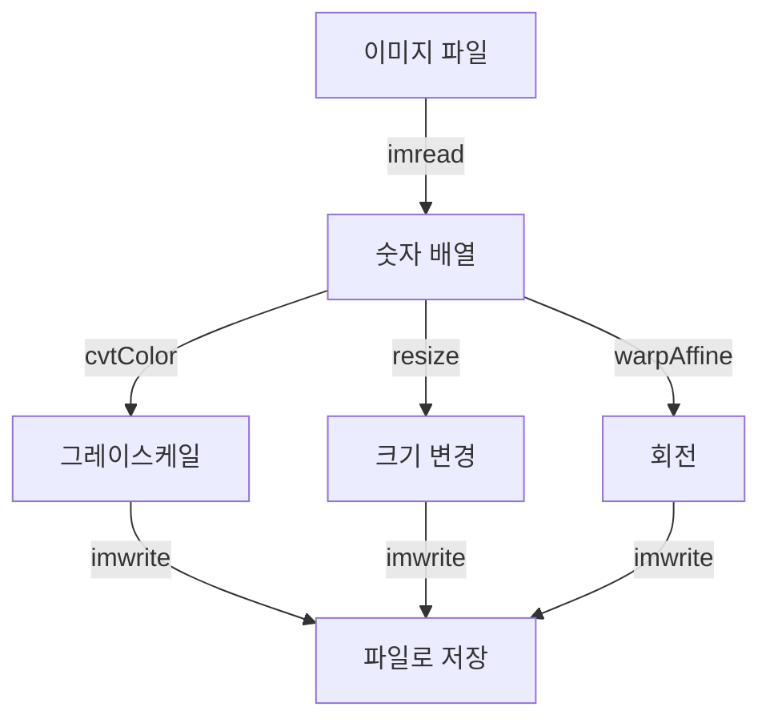
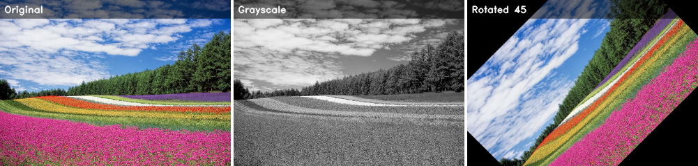

# 01. OpenCV 기초 — 이미지 다운로드와 변환

- 생성일시: 2026-06-21 17:18
- 수정일시: 2026-06-25 22:17

> 실습 파일: `02_opencv_basics/01_image_download.py`, `02_opencv_basics/02_io_transform.py`

## 학습 목표

- 실습용 이미지를 웹에서 내려받는다.
- 이미지를 읽고 저장하는 법을 익힌다.
- 그레이스케일 변환, 크기 조절, 회전을 적용해 본다.
- OpenCV 가 이미지를 숫자 배열(NumPy)로 다룬다는 것을 이해한다.

## 먼저, 실습 이미지 내려받기

컴퓨터 비전 실습의 첫걸음은 다룰 이미지를 준비하는 일입니다. 이 특강에서는 저작권
걱정이 없는 무료 이미지 사이트 Pexels(https://www.pexels.com)에서 사진을 받아 씁니다.

```python
import requests

image_url = "https://images.pexels.com/photos/60628/flower-garden-blue-sky-hokkaido-japan-60628.jpeg?w=640"
file_name = "../data/images/sample.jpg"          # 다음 실습들이 읽는 공용 위치

response = requests.get(image_url, timeout=30)   # HTTP GET 요청
if response.status_code == 200:                  # 200 = 성공
    with open(file_name, "wb") as f:             # 'wb' = 바이너리 쓰기
        f.write(response.content)
    print("성공적으로 저장되었습니다.")
```

`requests.get` 으로 이미지 주소에 요청을 보내고, 응답이 성공(상태 코드 200)이면 받은
내용을 파일로 저장합니다. 이미지는 글자가 아니라 바이너리(0과 1의 덩어리)이므로
`"wb"` 모드로 씁니다.

```bash
cd 02_opencv_basics
uv run 01_image_download.py
```

> 여러 이미지와 모델을 한 번에 받으려면 저장소 루트의 `00_asset_downloader.py` 를
> 쓰면 됩니다. 위 코드는 다운로드가 어떻게 동작하는지 직접 보기 위한 학습용이며,
> 받는 위치(`../data/images/sample.jpg`)가 같아 바로 다음 실습이 이 파일을 그대로 씁니다.

## 이미지는 숫자다

OpenCV 에서 이미지는 가로×세로×3(파랑·초록·빨강) 크기의 숫자 배열입니다.
각 픽셀은 0~255 사이의 밝기 값으로 표현됩니다. 그래서 이미지를 자르고, 크기를
바꾸고, 회전하는 일이 모두 "배열을 다루는 일" 이 됩니다.

한 가지 기억할 점은 OpenCV 가 색 순서를 **BGR(파랑·초록·빨강)** 로 쓴다는 것입니다.
우리가 흔히 말하는 RGB 와 순서가 반대입니다.

## 변환의 흐름



## 핵심 코드

```python
import cv2

img = cv2.imread("../data/images/sample.jpg")   # 읽기
gray = cv2.cvtColor(img, cv2.COLOR_BGR2GRAY)     # 그레이스케일 변환
resized = cv2.resize(img, (w // 2, h // 2))      # 절반 크기로

center = (w // 2, h // 2)
matrix = cv2.getRotationMatrix2D(center, 45, 1.0)  # 중심 기준 45도
rotated = cv2.warpAffine(img, matrix, (w, h))

cv2.imwrite("../output/gray.jpg", gray)          # 저장
```

핵심 함수는 네 가지입니다.

- `cv2.imread` / `cv2.imwrite` 로 읽고 씁니다.
- `cv2.cvtColor` 로 색공간을 바꿉니다(여기서는 컬러를 흑백으로).
- `cv2.resize` 로 크기를 조절합니다.
- `cv2.getRotationMatrix2D` 와 `cv2.warpAffine` 으로 회전합니다.

## 실행 결과

```bash
cd 02_opencv_basics
uv run 02_io_transform.py
```

원본·흑백·회전 결과 창이 뜨고, `output/` 폴더에 변환된 이미지가 저장됩니다.



## 직접 해보기

- 회전 각도 `45` 를 `90` 이나 `30` 으로 바꿔 결과를 비교합니다.
- `cv2.resize` 의 크기를 `(w*2, h*2)` 로 바꾸면 어떻게 되는지 확인합니다.
- `data/images/` 의 다른 이미지(`people.jpg`)로 경로를 바꿔 실행해 봅니다.
