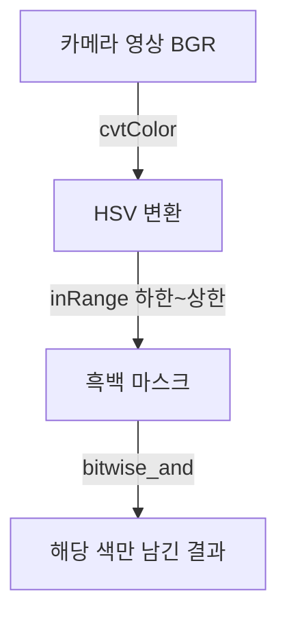
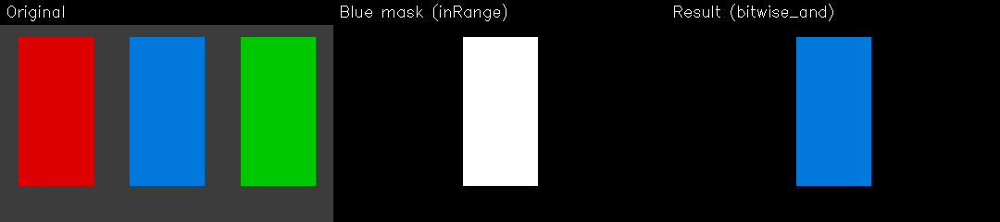

# 02. HSV 색공간과 색 검출

- 생성일시: 2026-06-21 17:18
- 수정일시: 2026-06-21 17:45

> 실습 파일: `02_opencv_basics/03_hsv_masking.py`

## 학습 목표

- RGB 와 HSV 의 차이를 이해한다.
- `inRange` 로 특정 색만 골라내는 마스크를 만든다.
- `bitwise_and` 로 원하는 색 영역만 남긴다.

## 왜 HSV 인가

빨간색을 검출한다고 생각해 봅시다. RGB 로는 밝은 빨강, 어두운 빨강, 그늘 속 빨강이
모두 값이 크게 달라서 "빨강의 범위" 를 정하기 어렵습니다.

HSV 는 색을 세 가지로 나눕니다.

- H(Hue, 색상): 빨강·초록·파랑 같은 "색의 종류". 0~179 범위의 각도.
- S(Saturation, 채도): 색의 진하기.
- V(Value, 명도): 밝기.

색의 종류가 H 한 축에 모이기 때문에, "H 가 0 근처면 빨강" 처럼 색을 범위로 잡기
쉬워집니다. 그래서 색 검출에는 HSV 가 훨씬 유리합니다.

## 색 검출의 흐름



## 핵심 코드

```python
hsv = cv2.cvtColor(frame, cv2.COLOR_BGR2HSV)        # BGR 를 HSV 로
mask = cv2.inRange(hsv, (95, 80, 80), (130, 255, 255))  # 파랑 범위만 흰색(255)
result = cv2.bitwise_and(frame, frame, mask=mask)   # 마스크 영역만 남김
```

`inRange` 는 지정한 하한~상한 사이의 픽셀만 흰색(255), 나머지는 검정(0)인
흑백 마스크를 만듭니다. `bitwise_and` 는 그 마스크가 흰색인 곳의 원본 색만 남기고
나머지는 지워, 화면에서 "파란 물체만 보이게" 합니다.

아래는 빨강·파랑·초록 색판에서 파랑만 골라낸 예입니다. 가운데가 `inRange` 가 만든
마스크, 오른쪽이 `bitwise_and` 로 파랑만 남긴 결과입니다.



빨강은 H 가 0 과 179 양 끝에 걸쳐 있어 범위를 두 개로 나눠 잡습니다. 이 점은
다음 장의 빙고 게임에서 다시 다룹니다.

## 실행

```bash
cd 02_opencv_basics
uv run 03_hsv_masking.py
```

`1`~`5` 키로 추출할 색(빨강·노랑·초록·파랑·보라)을 바꾸고, `ESC` 로 종료합니다.
해당 색 물건을 카메라에 비추면 그 부분만 화면에 남는 것을 볼 수 있습니다.

## 직접 해보기

- 형광등·창가·그늘에서 같은 색을 비추며 검출이 어떻게 달라지는지 봅니다.
- 검출이 약하면 코드의 채도·명도 하한(`80`)을 낮춰 봅니다. 너무 헐겁게 잡히면 높입니다.
- 이 "범위 조절(튜닝)" 감각이 다음 장 빙고 게임의 핵심입니다.
