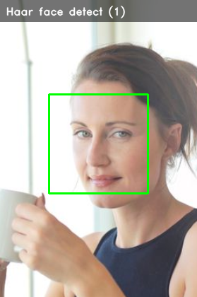
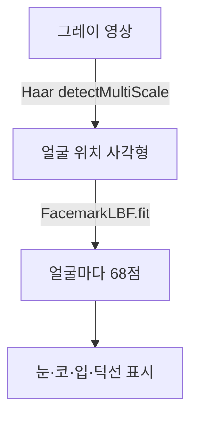
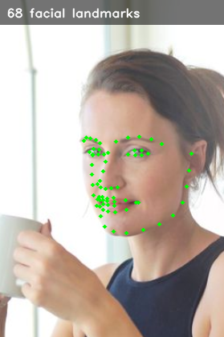

# 04. 얼굴·객체 검출 — Haar, HOG, 68 랜드마크 (2일차)

- 생성일시: 2026-06-21 17:18
- 수정일시: 2026-06-25 22:07

> 실습 폴더: `04_face_detection/` (`01_haar_detect.py`, `02_hog_people.py`, `03_landmarks_68.py`)

## 학습 목표

- 대표적인 검출 기술 세 가지를 비교한다.
- 얼굴을 찾고, 사람을 찾고, 얼굴 특징점 68개를 찾는다.
- "검출(찾기)" 과 다음 장의 "인식(누구인지)" 의 차이를 이해한다.

## 세 가지 기술 비교

| 기술 | 찾는 것 | 특징 |
|------|---------|------|
| Haar Cascade | 정면 얼굴 | 빠름. 고전적이고 가벼움 |
| HOG + SVM | 사람(전신) | 윤곽(기울기) 기반. 보행자 검출에 강함 |
| 68 랜드마크 | 얼굴 특징점 | 눈·코·입·턱선 위치를 정밀하게 |

세 가지 모두 추가 설치 없이 `opencv-contrib-python` 만으로 동작합니다.

## 1) Haar Cascade 얼굴 검출

```python
detector = cv2.CascadeClassifier("../data/models/haarcascade_frontalface_default.xml")
faces = detector.detectMultiScale(gray, scaleFactor=1.2, minNeighbors=5, minSize=(80, 80))
for (x, y, w, h) in faces:
    cv2.rectangle(frame, (x, y), (x+w, y+h), (0, 255, 0), 2)
```

미리 학습된 얼굴 패턴 파일(xml)을 불러와 `detectMultiScale` 로 여러 크기의 얼굴을
한 번에 찾습니다. `minNeighbors` 를 키우면 오검출이 줄지만 놓치는 얼굴도 늘어납니다.

```bash
cd 04_face_detection
uv run 01_haar_detect.py         # 웹캠
uv run 01_haar_detect.py image   # 샘플 사진으로 (카메라 없이 실습 가능)
```



## 2) HOG 사람 검출

```python
hog = cv2.HOGDescriptor()
hog.setSVMDetector(cv2.HOGDescriptor_getDefaultPeopleDetector())
rects, _ = hog.detectMultiScale(frame, winStride=(8, 8), scale=1.05)
```

HOG 는 이미지의 밝기 변화 방향(기울기) 분포로 사람의 윤곽을 잡습니다. OpenCV 에
내장된 보행자 검출기를 그대로 씁니다.

```bash
uv run 02_hog_people.py         # 웹캠
uv run 02_hog_people.py image   # 샘플 사진으로
```

## 3) 68점 얼굴 랜드마크

```python
facemark = cv2.face.createFacemarkLBF()
facemark.loadModel("../data/models/lbfmodel.yaml")
ok, landmarks = facemark.fit(gray, np.array(faces))   # faces: Haar 로 찾은 얼굴
```

얼굴을 먼저 Haar 로 찾은 뒤, 그 안에서 눈·눈썹·코·입·턱선의 점 68개를 찾습니다.
흔히 이 기능은 dlib 라이브러리를 쓰지만, dlib 는 설치가 까다롭습니다. 이 교재는
OpenCV 의 `FacemarkLBF` 로 같은 68점을 **추가 설치 없이** 얻습니다.

검출과 랜드마크는 두 단계로 이어집니다.



```bash
uv run 03_landmarks_68.py         # 웹캠
uv run 03_landmarks_68.py image   # 샘플 사진으로 (카메라 없이 실습 가능)
```



## 직접 해보기

- Haar 의 `minNeighbors` 를 3 과 8 로 바꿔 검출 개수가 어떻게 달라지는지 봅니다.
- 랜드마크 실습에서 얼굴을 좌우로 돌리면 점들이 어떻게 따라오는지 관찰합니다.
- 검출(얼굴이 어디 있나)과 인식(누구인가)이 어떻게 다른지 생각해 봅니다. 다음 장에서
  이 얼굴들을 "누구인지" 까지 맞춰 봅니다.
