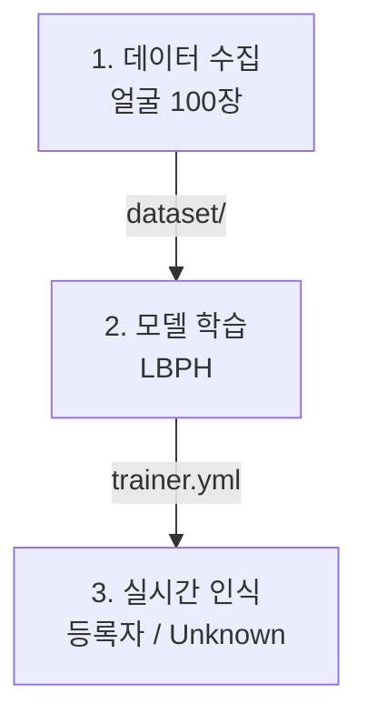

# 05. 얼굴 인식 시스템 (2일차 프로젝트)

- 생성일시: 2026-06-21 17:18
- 수정일시: 2026-06-21 17:45

> 실습 폴더: `05_face_recognition/` (`01_data_collection.py`, `02_trainer.py`, `main.py`)

## 학습 목표

- "수집 → 학습 → 인식" 3단계로 동작하는 시스템을 만든다.
- LBPH 알고리즘으로 등록된 사람을 구별한다.
- 출입 통제 시스템의 기본 원리를 이해한다.

## 검출과 인식의 차이

앞 장의 "검출" 은 얼굴이 어디 있는지를 찾는 것이고, 이번 장의 "인식" 은 그 얼굴이
**누구의 얼굴인지** 맞추는 것입니다. 인식을 하려면 먼저 사람마다 얼굴을 여러 장
보여주고 학습시켜야 합니다.

## LBPH 란

LBPH(Local Binary Patterns Histograms)는 얼굴의 작은 영역마다 밝기 패턴을 비교해
"질감의 지도" 를 만들고, 이 지도가 등록된 사람과 얼마나 비슷한지로 누구인지 판단합니다.
딥러닝보다 가볍고 적은 데이터로도 동작해 교육용으로 적합합니다.

## 3단계 흐름



### 1단계: 데이터 수집

```bash
cd 05_face_recognition
uv run 01_data_collection.py
```

ID와 이름을 입력하면 웹캠으로 본인 얼굴 100장을 찍어 `dataset/` 에 저장하고,
이름 정보를 `names.json` 에 기록합니다. 여러 사람이 각자 다른 ID로 실행하면
여러 명을 등록할 수 있습니다.

### 2단계: 모델 학습

```bash
uv run 02_trainer.py
```

수집한 얼굴들을 LBPH 로 학습해 `trainer/trainer.yml` 모델 파일을 만듭니다.

### 3단계: 실시간 인식

```bash
uv run main.py
```

```python
user_id, confidence = recognizer.predict(gray[y:y+h, x:x+w])
if confidence < CONF_THRESHOLD:        # 0에 가까울수록 정확
    name = names.get(user_id, ...)     # 등록된 사람 → 초록
else:
    name = "Unknown"                   # 미등록 → 빨강
```

웹캠 속 얼굴을 학습한 모델과 비교해, 등록된 사람이면 이름과 일치율을 초록색으로,
모르는 사람이면 "Unknown" 을 빨간색으로 표시합니다. 이것이 출입 통제의 기본 동작입니다.

## 직접 해보기

- 본인과 옆 사람을 각각 다른 ID로 등록하고, 둘을 번갈아 비춰 구별되는지 봅니다.
- `main.py` 의 `CONF_THRESHOLD`(기본 70)를 낮추면 더 엄격해지고(본인도 Unknown 가능),
  높이면 더 관대해집니다(남도 통과 가능). 적절한 값을 찾아봅니다.
- 안경 착용·조명 변화가 인식률에 어떤 영향을 주는지 실험해 봅니다.
