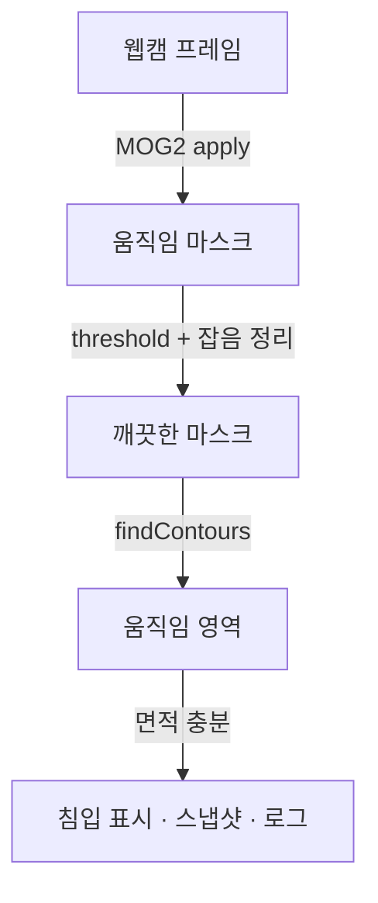

# 06. 움직임 감지 보안 시스템 (2일차)

- 생성일시: 2026-06-21 17:18
- 수정일시: 2026-06-21 17:44

> 실습 파일: `06_motion_security/main.py`

## 학습 목표

- 배경 차분(Background Subtraction)으로 움직임을 잡는다.
- 잡음을 정리하고 움직임 영역을 사각형으로 표시한다.
- 침입 감지 시 스냅샷과 로그를 남기는 보안 시스템을 만든다.

## 배경 차분의 원리

고정된 카메라라면, 가만히 있는 부분(벽·책상)은 "배경" 이고 새로 나타나 움직이는
부분(사람)은 "전경" 입니다. 배경 차분은 시간이 지나며 변하지 않는 부분을 배경으로
학습하고, 거기서 벗어나는 픽셀을 움직임으로 잡아냅니다.

OpenCV 의 `MOG2` 알고리즘이 이 일을 자동으로 해 줍니다.

## 처리 흐름



## 핵심 코드

```python
backsub = cv2.createBackgroundSubtractorMOG2(history=500, varThreshold=40, detectShadows=True)

mask = backsub.apply(frame)                      # 움직이는 부분만 흰색
_, mask = cv2.threshold(mask, 200, 255, cv2.THRESH_BINARY)   # 그림자 제거
mask = cv2.morphologyEx(mask, cv2.MORPH_OPEN, None, iterations=2)  # 잡음 정리
contours, _ = cv2.findContours(mask, cv2.RETR_EXTERNAL, cv2.CHAIN_APPROX_SIMPLE)

for c in contours:
    if cv2.contourArea(c) < MIN_AREA:   # 너무 작은 움직임은 무시
        continue
    x, y, w, h = cv2.boundingRect(c)
    cv2.rectangle(frame, (x, y), (x+w, y+h), (0, 0, 255), 2)
```

흐름은 다음과 같습니다. 배경 차분으로 움직임 마스크를 만들고, 그림자와 잡음을
정리한 뒤, 윤곽선을 찾아 일정 크기 이상인 움직임만 사각형으로 표시합니다.
움직임이 감지되면 `output/` 폴더에 스냅샷 이미지와 `security_log.txt` 기록을 남깁니다.

## 실행

```bash
cd 06_motion_security
uv run main.py
```

- `SPACE` 배경 다시 학습(자리를 옮겼거나 조명이 바뀌었을 때)
- `ESC` 종료

처음 몇 초는 배경을 학습하는 시간이라 움직임이 과하게 잡힐 수 있습니다. 잠시 후
안정됩니다.

## 직접 해보기

- `MIN_AREA`(기본 1500)를 키우면 작은 움직임을 무시하고, 줄이면 작은 움직임도 잡습니다.
- 손만 흔들 때와 몸 전체가 들어올 때 사각형 크기가 어떻게 달라지는지 봅니다.
- `output/security_log.txt` 를 열어 감지 시각이 기록되는 것을 확인합니다.
